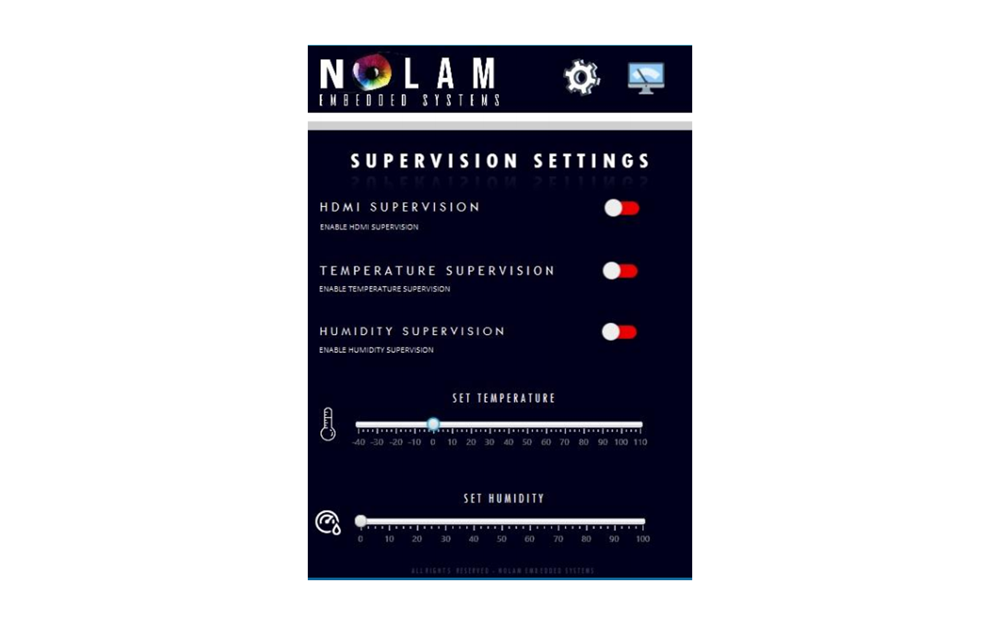
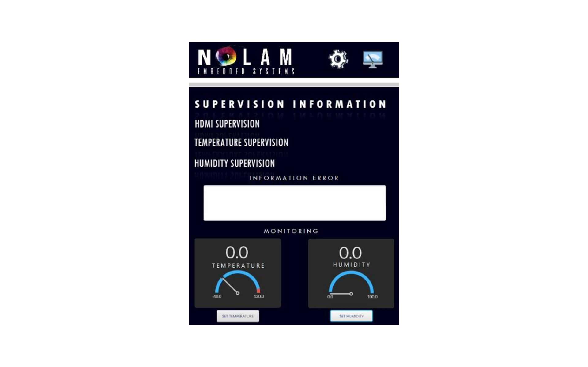

# Nolam-1553-IHM

This application allow you to set the parameters of a 1553 IHM card with a server / client app.

### Usage 

The card is functional only if the computer is connected to a 1553 HMI card.

### Screenshot

### Client

### Server

